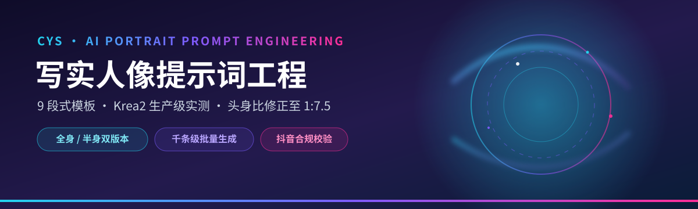
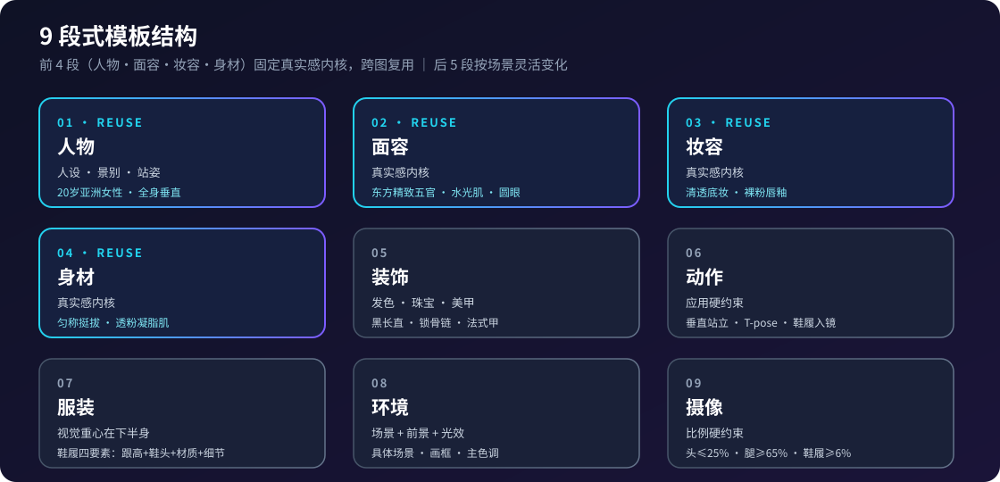

<p align="center">
  <a href="https://github.com/chengyansen-ai/cys-migration-skill">
    
  </a>
</p>

<p align="center">
  
  
  
  
  
  
  
  
</p>

<h1 align="center">写实人像提示词工程 · cys-migration</h1>

<p align="center">
  <b>9 段式模板 · Krea2 生产级实测 · 跨平台通用</b><br>
  一套从 <b>5,000+ 条真实出图</b> 中淬炼的人像提示词方法论<br>
  适配 Coze / Dify / Claude / Codex / ComfyUI / Krea2 / GPT Image 2
</p>

<p align="center">
  <sub>作者 <b>cys</b> · 核心理念：真实感第一，量产先行，数据驱动</sub>
</p>

---

## 📑 目录

- [为什么需要](#为什么需要)
- [✨ 核心亮点](#核心亮点)
- [🚀 快速开始](#快速开始)
- [🧩 9 段式模板](#9-段式模板)
- [📐 两种构图输出](#两种构图输出)
- [🎯 ComfyUI 应用硬约束](#comfyui-应用硬约束)
- [⚙️ Krea2 生产参数实测](#krea2-生产参数实测)
- [📏 头身比修正技法](#头身比修正技法)
- [🔤 CLIP 速查](#clip-速查)
- [🎨 风格预设 30+](#风格预设-30)
- [💡 使用示例](#使用示例)
- [🏭 批量生产能力](#批量生产能力)
- [📂 仓库结构](#仓库结构)
- [🗺️ 路线图](#路线图)
- [🤝 贡献](#贡献)
- [📄 许可证](#许可证)

---

## 为什么需要

写人像提示词，你大概率遇到过这些坑：

> 🤔 **头大身小**：AI 一生成全身就变成 1:5 的「大头娃娃」，怎么调都回不到 1:7。
> 🤔 **AI 味太重**：皮肤像塑料、光影假、一眼就被识别出是 AI，图生视频直接穿帮。
> 🤔 **动作迁移翻车**：骨骼识别失败、鞋履不出镜、腿占比不够，源图没法用。
> 🤔 **批量即翻车**：千条生成要么重复换皮、要么踩平台违规红线被限流。

本技能不堆理论，只给**从真实出图与 Krea2 生产管线里验证过**的解法——模板结构化、参数锁定、合规内建。

---

## ✨ 核心亮点

| 🧩 **9 段式模板** | 🎯 **动作迁移硬约束** | ⚙️ **Krea2 生产实测** |
| :--- | :--- | :--- |
| 人物→面容→妆容→身材→装饰→动作→服装→环境→摄像，前 4 段跨图复用 | 垂直站姿 / T-pose / 鞋履入镜 / 头≤25%·腿≥65%，带 CHECK LIST | CFG 永久锁定 1.0（无负向）、LoRA ≤0.6、两阶段 hires-fix 管线 |

| 📏 **头身比修正** | 🏭 **千条级批量** | ✅ **抖音合规校验** |
| :--- | :--- | :--- |
| Token 权重反转 + LoRA 降权 + 低角度仰拍，1:5 → 1:7~1:7.5 | 1000 条全唯一、零重复、零冲突 | 精确短语白名单，生成即过审 |

| 🎨 **30+ 风格预设** | 🌐 **跨平台加载** | 📚 **22 篇权威指南** |
| :--- | :--- | :--- |
| 10 类国风形制 + 20+ 现代/海外美学 | Coze / Dify / Claude / Codex / Cursor / ComfyUI | 跨文化美学 + 4 大公式共识 + ACM 文化增强 |

---

## 🚀 快速开始

**① 取技能**
```bash
git clone https://github.com/chengyansen-ai/cys-migration-skill.git
```

**② 加载（任选其一）**

| 平台 | 方式 |
| --- | --- |
| Coze 编程 | 上传 `.zip`（含 SKILL.md），系统自动解析 |
| Dify | 提示词模板法：嵌入 9 段式 + `{{变量}}` 占位 |
| Claude Code | 放入 `~/.claude/skills/cys-migration-skill/` |
| Codex CLI | 放入 `~/.codex/skills/cys-migration-skill/` |
| 手动法 | 直接打开 `SKILL.md` 复制提示词使用 |

**③ 跑生成器（可选）**
```bash
cd scripts
python gen_v3.py 20        # 全身照（动作迁移源图）批量生成 20 条
python gen_v4_halfbody.py 20  # 上半身中景照 20 条
python selftest.py         # 自测：生成 + 合规校验
```

---

## 🧩 9 段式模板

<p align="center">
  
</p>

```
人物：[人设]，[景别]，[场景]，年龄约20岁，[站姿类型]
面容：[真实感内核：东方精致五官 / 水光肌 / 圆眼有神 / 瓜子脸]
妆容：[真实感内核：清透底妆 / 淡雅眼妆 / 裸粉唇釉]
身材：[真实感内核：匀称挺拔 / 曲线自然 / 白皙透粉凝脂肌]
装饰：[发色 / 珠宝配饰 / 美甲，可按需改]
动作：[ComfyUI 应用范式：垂直站立 T-pose；或自由范式：重氛围]
服装：[视觉重心在下半身，鞋履四要素：跟高+鞋头+材质+细节]
环境：[具体场景 + 前景画框 + 中景 + 远景 + 光效 + 主色调]
摄像：[头≤25% / 腿≥65% / 鞋履≥6% / 全身等比无畸变]
```

> 提示词本体用中文，复杂详细优先，长度无限制。

---

## 📐 两种构图输出

| 场景 | 全身照（应用源图） | 上半身中景照（视频参考） |
| --- | --- | --- |
| 景别 | 全身垂直站立，标准采集站姿 | 上半身中景（腰部以上） |
| 动作 | 双脚并拢，双手下垂，T-pose | 正面直立，双手自然摆放 |
| 鞋履 | **必须入镜**，清晰展示在底部 | 不入镜，与下半身协调 |
| 约束 | 鞋履≥6%，头≤25%，腿≥65% | 85mm 镜头，头面部≤40% |

---

## 🎯 ComfyUI 应用硬约束

生成源图时逐条核对：

- [ ] 全身垂直站立 / 标准采集站姿（T-pose）
- [ ] 双脚并拢，双手下垂贴身体两侧，手指放松
- [ ] 头部正直、面部正对镜头；双肩下沉；脊柱笔直
- [ ] **鞋履完整入镜，占比 ≥ 画面高度 6%**
- [ ] **头部占比 ≤ 画面总高 25%；腿部区域 ≥ 人物高度 65%**
- [ ] 全身等比无畸变、无 AI 痕迹
- [ ] 8K 超高清、RAW 格式、焦点从头到脚清晰锐利
- [ ] 构图居中，人物占画面约 80% 高度

---

## ⚙️ Krea2 生产参数实测

> 来自 `生图-01-批量动漫.json` 工作流，经多轮出图验证，直接复制可用。

### 两阶段 hires-fix 管线

| 阶段 | 采样器 | 步数 | CFG | 调度器 | 分辨率 |
| --- | --- | --- | --- | --- | --- |
| 粗采 | KSamplerAdvanced | 8 | **1.0** | linear_quadratic | 1080×1920 |
| 放大 | ImageUpscaleWithModel | — | — | — | — |
| 精修 | KSamplerAdvanced | 10 | **1.0** | euler / simple | latent 输入 |

### CFG 黄金法则 [锁定]
- **CFG 永久锁定 1.0**（粗采与精修统一）：Turbo 蒸馏版原生支持 CFG=1.0 自由发挥，出图最美最自然；CFG=3.0 会压制创造力→图变平变丑，已弃用。
- **不使用负向提示词**：头身比/鞋履靠正向段9 约束 + 描述引导兜底，负向留空（CFG=1.0 下负向会打乱权重结构）。

### LoRA 三件套

| 参数 | 建议值 |
| --- | --- |
| enable_lora? | true |
| LoRA Strength | **≤ 0.6**（角色 LoRA 放大头部偏置） |
| Trigger Word | 按角色训练时的触发词填写 |

**实测结论**：头身比 1:7~1:7.5 ✅ / 垂直 T-pose ✅ / 鞋履 6-8% ✅ / 五官·皮肤·背景达标 ✅

---

## 📏 头身比修正技法

从 1:5 到 1:7~1:7.5，三段联动：

1. **Token 权重反转（最关键）**：面部描述→精简版，腿脚描述→强化版。原理：描述重心 = 模型画面重心。
2. **LoRA 权重 ≤ 0.6**：角色 LoRA 训练数据多为特写，天然放大头部，必须降权 + 提示词反向补偿。
3. **135mm + 膝高机位**：长焦压缩透视拉长身形 + 低角度自然压头。国外 Krea2 论坛用 `low-angle camera perspective` 印证有效。
4. **硬约束兜底**：头≤25% + 腿≥65% + 鞋履≥6%。

---

## 🔤 CLIP 速查

| 底模 | CLIP | 节点 |
| --- | --- | --- |
| Klein 9B | qwen_3_8b.safetensors | LongCLIPTextEncodeFlux |
| Klein 4B | qwen_3_4b.safetensors | LongCLIPTextEncodeFlux |
| Krea2 | Krea2 专用（type=krea2） | 标准文本编码 |
| Flux.1 | T5-XXL | CLIPTextEncodeFlux |
| Z-Image | Qwen3-8B CLIP | LongCLIPTextEncodeFlux |

---

## 🎨 风格预设 30+

### 国风 · 10 类

| 风格 | 关键词 | 配色 |
| --- | --- | --- |
| 魏晋风骨 | 黛蓝罗纱交领、竹林晨雾 | 翠竹绿 · 晨雾白 · 光束金 |
| 唐风盛世 | 齐胸襦裙、云头锦履、牡丹园 | 牡丹粉 · 汉白玉白 · 琉璃金 |
| 宋制清雅 | 雪白百迭裙、天青褙子 | 天青 · 雪白 · 水绿 |
| 明制端庄 | 石青百褶长裙、玄黑立领长袄 | 汉白玉白 · 琉璃金 · 地砖灰 |
| 民国名媛 | 改良旗袍、老洋房爵士 | 旗袍色 · 老上海暖黄 · 暗红 |
| 敦煌西域 | 飞天披帛、金箔阔腿、莫高窟 | 壁画彩 · 赭红 · 光束金 |
| 暗黑哥特 | 丝绒曳地裙、古堡彩窗 | 深夜蓝 · 银 · 火光橙 |
| 西部牛仔 | 高腰牛仔、流苏皮马甲 | 牛仔蓝 · 荒漠赭 · 落日金 |
| 童话森林 | 层叠薄纱、苔藓森林 | 翠绿 · 金 · 童话粉彩 |
| 当代风尚 | 解构半裙、艺术画廊 | 白 · 水磨石灰 · 画作彩 |

### 现代 / 海外（20+ 种）

赛博朋克 · 日式和风 · 韩系韩服 · 运动机能 · 复古港风 · 芭蕾舞者 · Mob Wife · Quiet Luxury · Coquette · 美拉德 · 多巴胺 · 法式优雅 · 英伦学院 · 北欧极简 · 波西米亚 · 蒸汽朋克 · 未来科幻

完整鞋履/配色/环境词库见 `references/style-presets.md`

---

## 💡 使用示例

**示例 A · 中文 9 段式（ComfyUI 应用源图 · 唐风）**

```
人物：20岁亚洲年轻女性，全身垂直站立照，牡丹园，标准采集站姿
面容：[真实感内核]
妆容：[真实感内核]
身材：[真实感内核]
装饰：[黑长直发，简约银质锁骨链]
动作：[ComfyUI 应用范式] 脚穿胭脂红云头锦履，平底，鞋面盘金绣
服装：齐胸襦裙高腰及踝，胭脂红长裙占画面4/5；月白真丝大袖对襟衫
环境：大唐盛世牡丹园，汉白玉栏杆蜿蜒，主色牡丹粉+汉白玉白+琉璃金
摄像：[ComfyUI 应用范式] 全身等比无畸变，头≤25%，腿≥65%
```

**示例 B · 英文摄影风（跨平台 · 适用于 GPT Image 2 / 海外模型）**

> 主用 Krea2 管线见上文 ⚙️ Krea2 生产参数实测；此示例展示跨平台英文写法。

```
Full body photograph of a young Chinese woman, celestial maiden.
She wears a floor-length soft lilac sheer silk hanfu.
Footwear: ivory silk slippers with silver cloud embroidery.
Standing naturally, feet parallel. Shot on 50mm f/2.8, Kodak Portra 400.
```

**示例 C · 赛博朋克（变量段替换）**

```
服装：哑黑机能风衣敞开，网纱连衣裙垂坠及踝；脚穿厚底机能靴
环境：雨夜霓虹街区，全息广告浮空
摄像：[ComfyUI 应用范式] 头≤25%，腿≥65%，鞋履≥6%
```

---

## 🏭 批量生产能力

| 能力 | 规格 | 验证结果 |
| --- | --- | --- |
| 风格类 × 专属词库 | 15 大类，每类 14 服装 + 5 鞋履 + 8~12 饰品 + 11+ 背景 | 协调度 **100%** |
| 背景唯一性 | 1,956 种场景×光影组合池，pop() 弹出 | 1000/1000 唯一 |
| 内部冲突检测 | 领×袖矛盾自动拦截 | 实测 **0 冲突** |
| 抖音合规 | 精确短语白名单匹配 | 实测 **0 违规** |
| 款式唯一性 | 八元组编码 | 1000/1000 唯一 |

---

## 📂 仓库结构

```
cys-migration-skill/
├── SKILL.md                      # 技能主体（中文9段式 / 动作迁移约束 / 合规边界）
├── README.md                     # 本文件
├── LICENSE                       # MIT © 2026 cys
├── banned-words.txt              # 抖音违规词精确短语（生成器 BANNED 校验权威源，内联）
├── 平台合规通用.md               # AI标识/四平台审核/通用软色情红线（与二次元技能共用基线）
├── motion-migration-constraints.md  # 动作迁移硬约束 CHECK LIST（写实/动漫通用）
├── assets/
│   ├── banner.svg                # 仓库头图
│   └── 9-section.svg             # 9 段式结构信息图
├── references/
│   ├── style-presets.md          # 30+ 风格签名 / 鞋履配色 / 服装词库
│   ├── style-presets.md.annotated # 风格预设带注释解读版
│   ├── global-knowledge.md       # 22 篇指南：公式共识 / 文化增强 / 多平台写法
│   ├── dance_fashion-trends.md   # 4,141+ 条平台热点（舞种+穿搭+鞋履+BGM）
│   ├── global-taxonomy.md        # 15 大类风格专属词库（防换皮铁律）
│   ├── coordinated-generation.md # v3 协调生成方法论
│   ├── real-portrait-corpus.md   # 桌面源文件提炼写实语料库（服装/鞋履/背景/光线）
│   ├── 真人内容边界.md           # 真人写实专属合规（肖像权/可识别性/深度合成）
│   └── 亚洲年轻女性穿搭词库.json # 服装色彩结构化词库
└── scripts/
    ├── gen_v3.py                 # 全身照（动作迁移源图）批量生成器
    ├── gen_v4_halfbody.py        # 上半身中景照批量生成器
    ├── extract_corpus.py         # 从源文件提炼语料库脚本
    └── selftest.py               # 自测：生成+合规校验
```

---

## 🗺️ 路线图

- [ ] 可视化生成器 WebUI（零代码调参出图）
- [ ] 视频动作迁移联动工作流（提示词→骨架→成片一键链路）
- [ ] 更多底模 CLIP 适配对照（Wan / LTX / Hunyuan 等）
- [ ] 风格库社区共建（PR 提交新国风/海外形制）

---

## 🤝 贡献

欢迎一起把这套方法论打磨得更强：

- 🐛 **提 Issue**：发现模板/参数/合规问题，直接开 issue 描述复现步骤
- 🔧 **发 PR**：风格库补充、生成器优化、跨平台适配都欢迎
- 📖 **补文档**：`references/` 下任何可复用的实战经验都可提交

提交前请跑一遍 `python scripts/selftest.py` 确保合规校验通过。

---

## 📄 许可证

MIT License © 2026 cys

---

<p align="center">
  <sub>⭐ 如果这个技能帮你出到了满意的图，欢迎 Star 支持，也欢迎分享给更多人 🌟</sub>
</p>

<p align="center">
  <sub>数据驱动 · 实测优先 · 迭代不止</sub>
</p>
